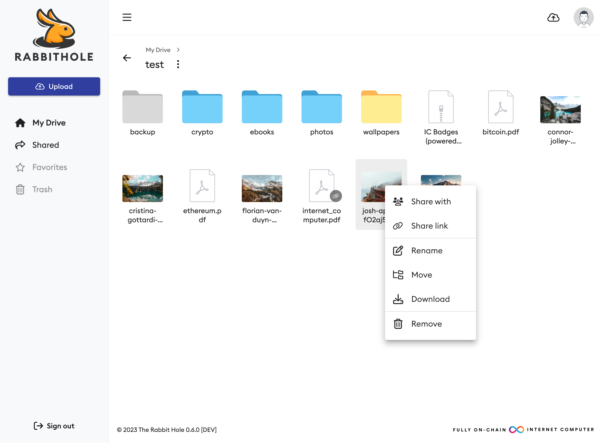
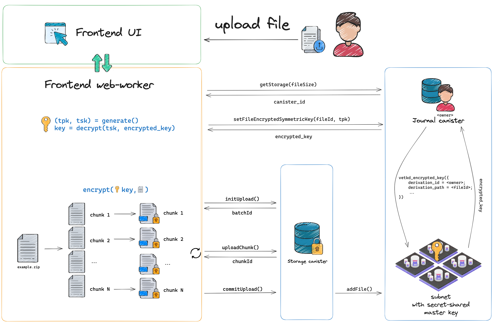
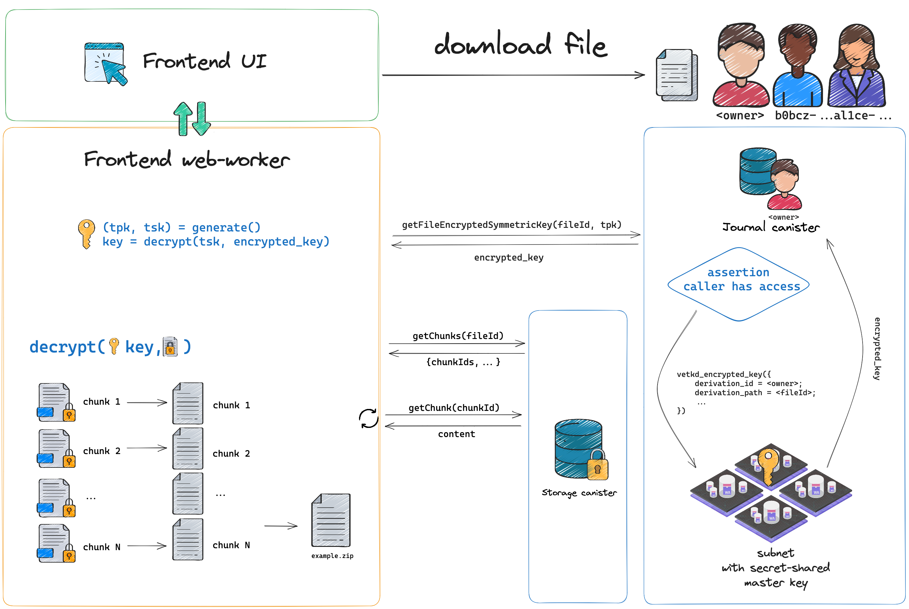
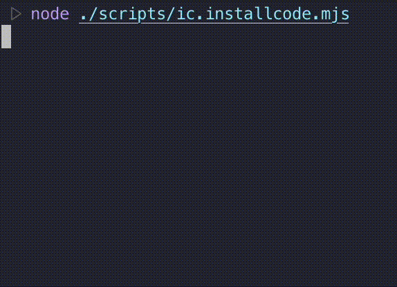

# The Rabbit Hole

[Rabbithole.app](https://rabbithole.app) is an encrypted file storage service based on the decentralized [Internet Computer](https://internetcomputer.org/).



<details>
<summary>Upload scheme</summary>

</details>
<details>
<summary>Download scheme</summary>

</details>


# Deploy locally

If this is your first time installing a project, then just type:
```sh
yarn install # npm install
./scripts/deploy.sh
```

## Building canisters

Table of available arguments for scripts:
| Argument | Default | Values | Description |
| -------- | ------- | ------ | ----------- |
| $1 | `local` | `ic`, `local`, ... | the network alias |
| $2 | `upgrade` | `install`, `reinstall`, `upgrade` | specifies the type of deployment |


The project comes with scripts for building all 3 types of canisters:
### main:
```sh
./scripts/build.sh
# ./scripts/build.sh ic
# ./scripts/build.sh ic reinstall
```

### journal:
```sh
./scripts/build_journal.sh
```

### storage:
```sh
./scripts/build_storage.sh
```

You can also use a node script to upgrade user canisters:
```sh
node ./scripts/ic.installcode.mjs
```



Table of available arguments for scripts:
| Argument | Default | Values | Description |
| -------- | ------- | ------ | ----------- |
| `-l`, `--list` ||| Show only the list of canisters |
| `--canister-id <journalId>` ||| Install code to specific canister id |
| `-t`, `--type <type>` |`journal`|`journal`, `storage`| User canister type |
| `-m`, `--mode <mode>` | `upgrade` | `install`, `reinstall`, `upgrade` | Specifies the type of deployment |
| `-n`, `--network <network>` | `local` | `ic`, `local`, ... | Overrides the environment to connect to |
| `-c`, `--concurrent <number>` | Infinity || Maximum number of concurrent canister upgrade requests |

## Roadmap
- [x] Basic operations
  - [x] create folders
  - [x] rename
  - [x] move with drag and drop
  - [x] move using a dialog with a destination folder selection
  - [x] delete
- [x] Extended operations
  - [x] recursive folder merging
  - [x] replace old file in case of name conflict
  - [x] share public
  - [x] share with users
  - [x] share with time-lock option
  - [x] multi-color folders
  - [ ] file history
  - [ ] batch operations
- [x] Navigation
  - [x] folder navigation by path
  - [x] breadcrumbs
- [x] Uploading
  - [x] upload files
  - [x] upload folders
  - [x] pausable/resumable uploads
  - [x] queue with the number of concurrent uploads
  - [x] e2ee with vetkd
- [ ] Downloading
  - [x] files
  - [ ] folders as zip-archive
- [ ] I18n 
  - [x] English
  - [ ] Russian
  - [ ] Deutsch
- [ ] Thumbnails
  - [x] images
  - [ ] audio
  - [ ] video
  - [ ] pdf
- [ ] Account wallet
  - [x] check balance
  - [x] transfer tokens
  - [x] validating amount/recipient
  - [x] ICP
  - [ ] ckBTC
  - [ ] ckETH/ckUSDT
- [x] Web Workers to improve UI performance
  - [x] upload/download files
  - [x] polling canisters
  - [x] user session
  - [x] generating thumbnails
  - [x] keep batch alive when upload is paused
- [x] Registration
  - [x] with ICP
  - [x] with an invitatation code
- [x] Developers scripts
  - [x] upgrading canisters
  - [x] storage capacity testing
- [ ] Auto top-up user canisters
- [ ] Notification canister (WebSockets feature)
  - [ ] email (https outcalls)
- [ ] Collaborative journal (vetKD)
  - [ ] managing users and their rights (read/write/admin)
  - [ ] active upload of a file by a journal member
- [ ] Selling files
- [ ] Search
- [ ] Statistics
- [ ] File preview (audio/video/images/pdf)
- [ ] SNS DAO?
